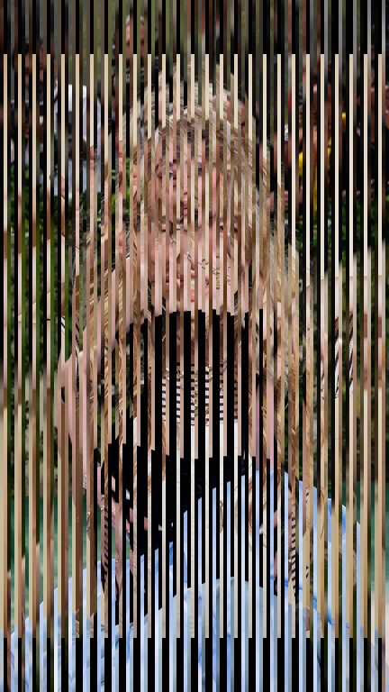

# Lenticular Image Interlacing Software

This Go server allows you to upload multiple images and interlace them for lenticular printing. The server uses the Gorilla Mux router and the `disintegration/imaging` package for image processing.




## Features

- Upload multiple images
- Interlace images based on a specified strip width
- Returns the interlaced image as a PNG

## Prerequisites

- Go (version 1.16 or higher)
- Git (to clone the repository)

## Installation

1. **Clone the repository:**

   ```bash
   git clone https://github.com/S1D007/Lenticular-Proto.git
   cd Lenticular-Proto
   ```

2. **Install dependencies:**

   Use the following command to install the required packages:

   ```bash
   go get -u github.com/gorilla/mux
   go get -u github.com/disintegration/imaging
   ```

3. **Run the server:**

   Start the server by running:

   ```bash
   go run main.go
   ```

   The server will start on `http://localhost:8081`.

## API Endpoint

### `POST /upload`

This endpoint allows you to upload images and specify the strip width for interlacing.

**Request Parameters:**

- `images`: One or more images to be interlaced (multipart form data).
- `stripWidth`: (Optional) A float representing the width of the strips for interlacing. If not provided, defaults to `8.0`.

**Example Request Using curl:**

```bash
curl -X POST -F "images=@path_to_image1.jpg" -F "images=@path_to_image2.jpg" -F "stripWidth=10.5" http://localhost:8081/upload
```

**Response:**

- On success: The interlaced image will be returned as a PNG.
- On error: A JSON response with an error message will be returned.

**Example Error Response:**

```json
{
  "error": "Unable to parse form"
}
```

## Acknowledgments

- [Gorilla Mux](https://github.com/gorilla/mux) for routing
- [disintegration/imaging](https://github.com/disintegration/imaging) for image processing